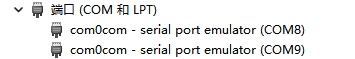
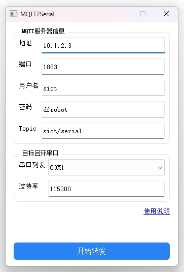

# MQTT2Serial

将 MQTT 消息订阅后转发到本机串口；支持使用回环串口（com0com）把消息喂给本机软件进行联调与测试。

## 项目简介
- 订阅指定 `Topic` 的 MQTT 消息并以原始字节写入串口。
- 支持选择真实串口或回环串口进行转发。
- 简洁的图形界面，启动/停止一键控制，错误状态有明确提示。
- 适用于设备联调、协议仿真、PC 端软件联测等场景。

## 使用流程说明
### 首次使用（安装回环串口）
- 安装 com0com：Setup_com0com_v3.0.0.0_W7_x64_signed.exe
- 安装完成后，Windows 设备管理器会生成一对回环串口（例如 `COM5 <-> COM6`）。任意一端写入的数据会从另一端读出。
 

### 正常使用
- 启动dist文件夹中的 MQTT2Serial.exe
- 填写 SIoT/MQTT 服务器信息：`地址`、`端口`、`用户名`、`密码`。
- 输入要接收数据的 `Topic`（例如 `siot/serial`）。
- 选择要转发的串口（可选回环串口或真实设备串口），设置 `波特率`。
- 点击“开始转发”启用；需要结束时点击“停止转发”。

 

### 回环串口典型用法
- 在被测 PC 软件中打开回环对的其中一个串口（如 `COM6`）。
- 在本工具中选择另一端（如 `COM5`）作为转发目标。
- 当 MQTT 有新消息时，本工具会把原始字节写入 `COM5`，被测软件即可从 `COM6` 读到同样的数据。

## 注意事项
- 平台：建议 Windows 10/11。回环功能依赖 com0com，仅在 Windows 上可用。
- 波特率需与目标软件/设备一致，否则会出现乱码或读写异常。
- MQTT 消息的负载会按原始字节发送；若为文本，请确保编码为 UTF-8。
- 连接失败或串口打开失败会弹窗提示；停止转发会自动断开 MQTT 并关闭串口。

## 相关链接
- 使用说明（Gitee）：`https://gitee.com/liliang9693/mqtt2serial`
- com0com官方下载链接：`https://sourceforge.net/projects/com0com/files/com0com/`

